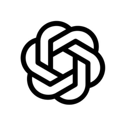
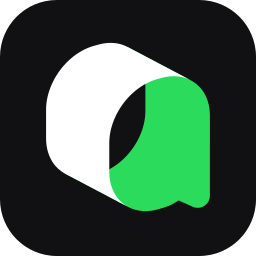

<p align="center">
  &nbsp;
  &nbsp;
  &nbsp;
  &nbsp;
  &nbsp;
  &nbsp;
  &nbsp;
  
</p>

<h1 align="center">AI Gateway</h1>

<p align="center">
  <strong>Unified AI provider proxy & dashboard</strong><br>
  <span>Route, manage, and chat with 40+ AI providers through a single OpenAI-compatible endpoint.</span>
</p>

<p align="center">
  
  
  
  
</p>

---

## Features

- **🔀 Multi-provider proxy** — 40+ AI providers through a single `/v1/chat/completions` endpoint
- **🔄 Combo routing** — Chain multiple providers with fallback, round-robin, and sticky strategies
- **📊 Usage tracking** — Per-provider quota monitoring with auto-refresh
- **🔑 API key management** — Full access or per-model restriction with multi-select
- **🚫 Blocked models** — Per-account model blocking for cost control
- **📱 Caveman mode** — Terse system prompts (lite/full/ultra) for mobile-friendly responses
- **🧠 Reasoning support** — Thinking mode pass-through for DeepSeek, MiMo, Kiro, Grok, and more
- **🔌 OAuth + API key** — Connect via OAuth (Codex, Claude, Kiro, xAI, GitHub, etc.) or API key
- **📈 Request logging** — Full request/response detail with token usage stats
- **🌐 Translator** — Built-in translator tool in dashboard
- **📝 Quota dashboard** — Track per-provider usage and remaining limits
- **🎨 Modern dashboard** — Dark/light theme, responsive, real-time status

---

## Supported Providers

### 💬 LLM / Chat (40+)

OpenAI, Anthropic (Claude), Gemini, DeepSeek, xAI (Grok), Mistral, OpenRouter, Groq, Codex, Kiro AI, Cursor, Cline, GitHub Copilot, Gemini CLI, Qwen, GLM, Kimi, MiniMax, Perplexity, Together, Fireworks, Cerebras, Cohere, NVIDIA, Hyperbolic, Morph, Nous Portal, CanopyWave, Cloudflare AI, SiliconFlow, Chutes, Routeway, BytePlus, Volcengine, MiMo Plan SGP, Vertex, Azure, B.AI, Antigravity, OpenCode, CommandCode, Ollama, Alibaba, iFlow, Qiniu, SwiftRouter, NanoBanana, Nebius, Qoder, AIMux, and more.

### 🔐 OAuth Providers

Codex (ChatGPT Plus), Claude Code, Kiro AI, GitHub Copilot, Cursor, Cline, CodeBuddy, xAI (Grok), Qoder, Gemini CLI, Nous Portal, Kilo Code, Antigravity, FreeBuff.

### 🔑 API Key Providers

OpenAI, Anthropic, xAI, Mistral, Groq, DeepSeek, OpenRouter, Perplexity, Together, Fireworks, Cerebras, Cohere, NVIDIA, Hyperbolic, Morph, CanopyWave, Cloudflare AI, SiliconFlow, Chutes, Routeway, BytePlus, Volcengine, MiMo Plan SGP, Vertex, Azure, B.AI, and many OpenAI-compatible providers.

---

## Quick Start

### Prerequisites

- **Node.js** 18+ or **Bun** 1.1+
- **Hono backend** running (see [ai-gateway-hono-backend](https://github.com/DEYLNN/ai-gateway-hono-backend))

### Setup

```bash
git clone https://github.com/DEYLNN/ai-gateway-next-frontend.git
cd ai-gateway-next-frontend
npm install
cp .env.example .env.local
```

### Environment

```env
# Backend connection
BACKEND_BASE_URL=http://127.0.0.1:18323
NEXT_PUBLIC_BACKEND_BASE_URL=http://localhost:18323

# Auth
JWT_SECRET=<same-as-backend>
AUTH_COOKIE_SECURE=false

# Data
DATA_DIR=/tmp/ai-gateway-next-frontend
```

### Run

```bash
npm run dev        # Dev mode (port 20128)
npm run build      # Production build
npm start          # Serve production build
```

---

## Architecture

```
┌─────────────────┐     ┌──────────────────┐     ┌─────────────────┐
│   Dashboard UI  │────▶│  Hono Backend    │────▶│  AI Providers    │
│   (Next.js 15)  │     │  (SSE proxy)     │     │  OpenAI, Claude, │
│                 │◀────│  port 18323      │◀────│  Gemini, xAI, etc│
└─────────────────┘     └──────────────────┘     └─────────────────┘
        │                       │
        │    ┌──────────────┐   │
        └───▶│  SQLite DB   │◀──┘
             │  (API keys,  │
             │   providers, │
             │   usage)     │
             └──────────────┘
```

### API Endpoints

| Endpoint | Description |
|----------|-------------|
| `POST /v1/chat/completions` | Chat completions (OpenAI-compatible) |
| `GET /v1/models` | List available models |
| `GET /health` | Health check |

### Key Features

- **Combo Routing** — Chain multiple providers with fallback/round-robin strategies
- **Model Aliases** — Use `kr/claude-sonnet-4.6` to route to Kiro, `cx/gpt-5.5` for Codex
- **Caveman Mode** — Inject terse system prompts (lite/full/ultra) for concise responses
- **Per-account blocking** — Block specific models on specific provider accounts
- **API key restrictions** — Create keys that only access selected models

---

## Provider Prefixes

| Prefix | Provider | Prefix | Provider |
|--------|----------|--------|----------|
| `kr` | Kiro AI | `cx` | OpenAI Codex |
| `gh` | GitHub Copilot | `cu` | Cursor |
| `cl` | Cline | `gc` | Gemini CLI |
| `or` | OpenRouter | `ds` | DeepSeek |
| `qw` | Qwen | `glm` | GLM |
| `cwv` | CanopyWave | `mms` | MiMo Plan SGP |
| `cf` | Cloudflare AI | `morph` | Morph LLM |
| `nous` | Nous Portal | `qd` | Qoder |
| `am` | AIMux | `xai` | xAI (Grok) |
| `oc` | OpenCode | `rwy` | Routeway |

---

## Deployment

- **Frontend:** Deploy to your own Vercel/Netlify instance
- **Backend:** Self-hosted Node.js/Bun with Hono proxy
- **Database:** SQLite (file-based, no external DB required)

---

## License

MIT

---

<p align="center">
  <sub>Built with ❤️ by <a href="https://github.com/DEYLNN">DEYLNN</a></sub>
</p>
