<p align="center">
  &nbsp;
  &nbsp;
  &nbsp;
  &nbsp;
  &nbsp;
  &nbsp;
  
</p>

<h1 align="center">AI Gateway</h1>

<p align="center">
  <strong>Unified AI provider proxy & dashboard</strong><br>
  <span>Route, manage, and monitor 100+ AI providers through a single API endpoint.</span>
</p>

<p align="center">
  
  
  
  
  
</p>

---

## Features

- **🔀 Multi-provider proxy** — OpenAI, Claude, Gemini, DeepSeek, xAI, and 100+ more through a single `/v1/chat/completions` endpoint
- **🔄 Auto-failover** — Combo routing with fallback, round-robin, and sticky strategies
- **📊 Usage tracking** — Per-provider quota monitoring with auto-refresh
- **🔑 API key management** — Full access or per-model restriction with multi-select
- **🚫 Blocked models** — Per-account model blocking for cost control
- **📱 Caveman mode** — Terse system prompts (lite/full/ultra) for mobile-friendly responses
- **🧠 Reasoning support** — Thinking mode pass-through for DeepSeek, MiMo, Kiro, and more
- **🔌 OAuth + API key** — Mix OAuth-based and API key-based providers
- **📈 Request logging** — Full request/response detail with token usage stats
- **🎨 Modern dashboard** — Dark/light theme, responsive, real-time status

---

## Supported Providers

<details open>
<summary><strong>💬 LLM / Chat (40+ providers)</strong></summary>
<br>
<table>
<tr>
<td align="center" width="90"><br><sub>OpenAI</sub></td>
<td align="center" width="90"><br><sub>Anthropic</sub></td>
<td align="center" width="90"><br><sub>Gemini</sub></td>
<td align="center" width="90"><br><sub>DeepSeek</sub></td>
<td align="center" width="90"><br><sub>xAI</sub></td>
<td align="center" width="90"><br><sub>Mistral</sub></td>
<td align="center" width="90"><br><sub>OpenRouter</sub></td>
<td align="center" width="90"><br><sub>Groq</sub></td>
</tr>
<tr>
<td align="center" width="90"><br><sub>Codex</sub></td>
<td align="center" width="90"><br><sub>Kiro AI</sub></td>
<td align="center" width="90"><br><sub>Cursor</sub></td>
<td align="center" width="90"><br><sub>Cline</sub></td>
<td align="center" width="90"><br><sub>GitHub</sub></td>
<td align="center" width="90"><br><sub>Gemini CLI</sub></td>
<td align="center" width="90"><br><sub>Qwen</sub></td>
<td align="center" width="90"><br><sub>GLM</sub></td>
</tr>
<tr>
<td align="center" width="90"><br><sub>Kimi</sub></td>
<td align="center" width="90">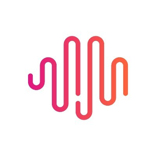<br><sub>MiniMax</sub></td>
<td align="center" width="90"><br><sub>Perplexity</sub></td>
<td align="center" width="90">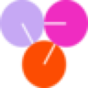<br><sub>Together</sub></td>
<td align="center" width="90"><br><sub>Fireworks</sub></td>
<td align="center" width="90">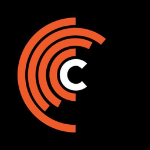<br><sub>Cerebras</sub></td>
<td align="center" width="90"><br><sub>Cohere</sub></td>
<td align="center" width="90">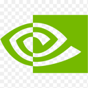<br><sub>NVIDIA</sub></td>
</tr>
<tr>
<td align="center" width="90"><br><sub>Hyperbolic</sub></td>
<td align="center" width="90"><br><sub>Morph</sub></td>
<td align="center" width="90"><br><sub>Nous</sub></td>
<td align="center" width="90">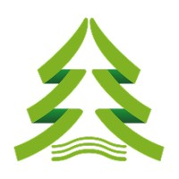<br><sub>CanopyWave</sub></td>
<td align="center" width="90"><br><sub>Cloudflare</sub></td>
<td align="center" width="90"><br><sub>SiliconFlow</sub></td>
<td align="center" width="90"><br><sub>Chutes</sub></td>
<td align="center" width="90"><br><sub>Routeway</sub></td>
</tr>
<tr>
<td align="center" width="90"><br><sub>BytePlus</sub></td>
<td align="center" width="90">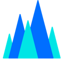<br><sub>Volcengine</sub></td>
<td align="center" width="90"><br><sub>MiMo SGP</sub></td>
<td align="center" width="90"><br><sub>Vertex</sub></td>
<td align="center" width="90"><br><sub>Azure</sub></td>
<td align="center" width="90">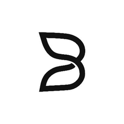<br><sub>B.AI</sub></td>
<td align="center" width="90"><br><sub>Antigravity</sub></td>
<td align="center" width="90"><br><sub>OpenCode</sub></td>
</tr>
<tr>
<td align="center" width="90">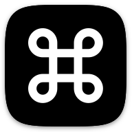<br><sub>CommandCode</sub></td>
<td align="center" width="90">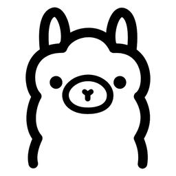<br><sub>Ollama</sub></td>
<td align="center" width="90"><br><sub>Alibaba</sub></td>
<td align="center" width="90"><br><sub>iFlow</sub></td>
<td align="center" width="90">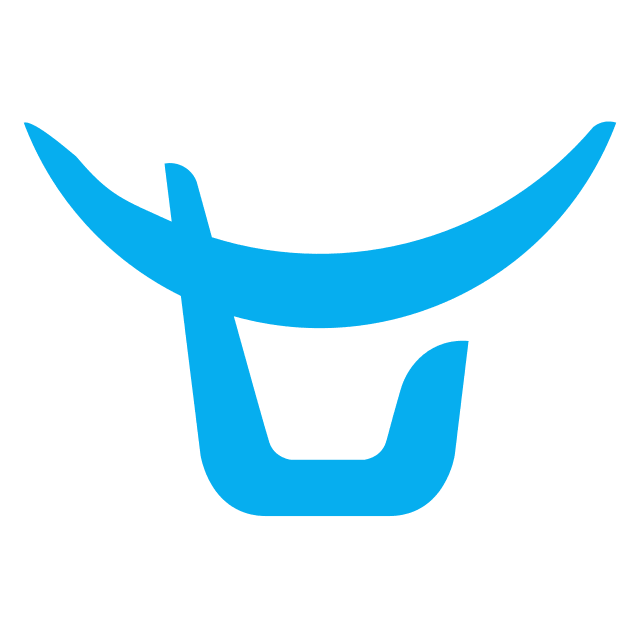<br><sub>Qiniu</sub></td>
<td align="center" width="90">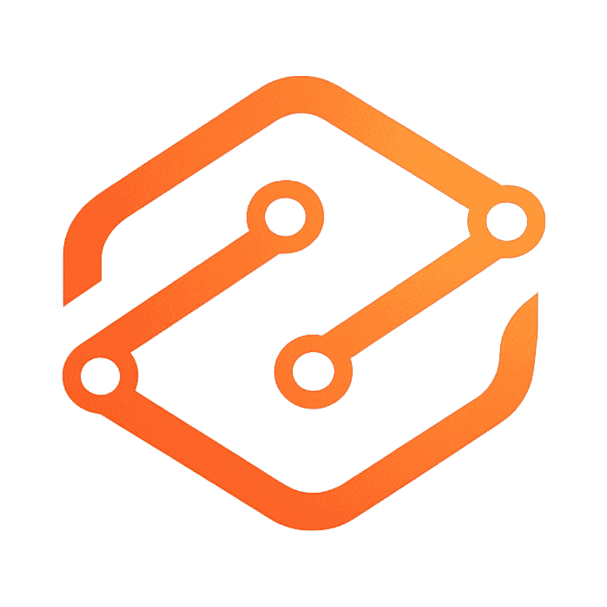<br><sub>SwiftRouter</sub></td>
<td align="center" width="90"><br><sub>NanoBanana</sub></td>
<td align="center" width="90"><br><sub>Nebius</sub></td>
</tr>
</table>
</details>

<details>
<summary><strong>🌐 Web / Subscription (2 providers)</strong></summary>
<br>
<table>
<tr>
<td align="center" width="90"><br><sub>Grok Web</sub></td>
<td align="center" width="90"><br><sub>Perplexity Web</sub></td>
</tr>
</table>
</details>

<details>
<summary><strong>🔊 Text-to-Speech (8 providers)</strong></summary>
<br>
<table>
<tr>
<td align="center" width="90"><br><sub>ElevenLabs</sub></td>
<td align="center" width="90"><br><sub>AWS Polly</sub></td>
<td align="center" width="90"><br><sub>Google TTS</sub></td>
<td align="center" width="90"><br><sub>Edge TTS</sub></td>
<td align="center" width="90"><br><sub>Cartesia</sub></td>
<td align="center" width="90"><br><sub>PlayHT</sub></td>
<td align="center" width="90">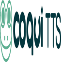<br><sub>Coqui</sub></td>
<td align="center" width="90"><br><sub>Inworld</sub></td>
</tr>
</table>
</details>

<details>
<summary><strong>🎨 Image & Video (8 providers)</strong></summary>
<br>
<table>
<tr>
<td align="center" width="90"><br><sub>Stability AI</sub></td>
<td align="center" width="90"><br><sub>Fal.ai</sub></td>
<td align="center" width="90"><br><sub>FLUX/BFL</sub></td>
<td align="center" width="90"><br><sub>Runway</sub></td>
<td align="center" width="90"><br><sub>Topaz</sub></td>
<td align="center" width="90">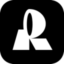<br><sub>Recraft</sub></td>
<td align="center" width="90"><br><sub>ComfyUI</sub></td>
<td align="center" width="90">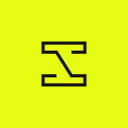<br><sub>SD WebUI</sub></td>
</tr>
</table>
</details>

<details>
<summary><strong>🔍 Embedding & Search (12 providers)</strong></summary>
<br>
<table>
<tr>
<td align="center" width="90"><br><sub>Jina AI</sub></td>
<td align="center" width="90"><br><sub>Voyage AI</sub></td>
<td align="center" width="90"><br><sub>Brave</sub></td>
<td align="center" width="90">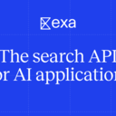<br><sub>Exa</sub></td>
<td align="center" width="90"><br><sub>Tavily</sub></td>
<td align="center" width="90"><br><sub>Firecrawl</sub></td>
<td align="center" width="90"><br><sub>Serper</sub></td>
<td align="center" width="90"><br><sub>Google PSE</sub></td>
</tr>
<tr>
<td align="center" width="90"><br><sub>SearchAPI</sub></td>
<td align="center" width="90"><br><sub>SearXNG</sub></td>
<td align="center" width="90"><br><sub>Linkup</sub></td>
<td align="center" width="90"><br><sub>You.com</sub></td>
</tr>
</table>
</details>

<details>
<summary><strong>🎤 Speech-to-Text (2 providers)</strong></summary>
<br>
<table>
<tr>
<td align="center" width="90"><br><sub>Deepgram</sub></td>
<td align="center" width="90">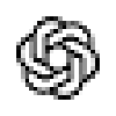<br><sub>AssemblyAI</sub></td>
</tr>
</table>
</details>

---

## Quick Start

### Prerequisites

- **Node.js** 18+ or **Bun** 1.1+
- **Hono backend** running (see [ai-gateway-hono-backend](https://github.com/DEYLNN/ai-gateway-hono-backend))

### Setup

```bash
git clone https://github.com/DEYLNN/ai-gateway-next-frontend.git
cd ai-gateway-next-frontend
npm install
cp .env.example .env.local
```

### Environment

```env
# Backend connection
BACKEND_BASE_URL=http://127.0.0.1:18323
NEXT_PUBLIC_BACKEND_BASE_URL=http://localhost:18323

# Auth
JWT_SECRET=<same-as-backend>
AUTH_COOKIE_SECURE=false

# Data
DATA_DIR=/tmp/ai-gateway-next-frontend
```

### Run

```bash
npm run dev        # Dev mode (port 20128)
npm run build      # Production build
npm start          # Serve production build
```

---

## Architecture

```
┌─────────────────┐     ┌──────────────────┐     ┌─────────────────┐
│   Dashboard UI  │────▶│  Hono Backend    │────▶│  100+ Providers  │
│   (Next.js 15)  │     │  (SSE proxy)     │     │  OpenAI, Claude, │
│                 │◀────│  port 18323      │◀────│  Gemini, etc.    │
└─────────────────┘     └──────────────────┘     └─────────────────┘
        │                       │
        │    ┌──────────────┐   │
        └───▶│  SQLite DB   │◀──┘
             │  (API keys,  │
             │   providers, │
             │   usage)     │
             └──────────────┘
```

### API Endpoints

| Endpoint | Description |
|----------|-------------|
| `POST /v1/chat/completions` | Chat completions (OpenAI-compatible) |
| `POST /v1/messages` | Claude Messages API |
| `POST /v1/embeddings` | Embeddings |
| `POST /v1/audio/speech` | Text-to-Speech |
| `GET /v1/models` | List available models |
| `GET /health` | Health check |

### Key Features

- **Combo Routing** — Chain multiple providers with fallback/round-robin strategies
- **Model Aliases** — Use `kr/claude-sonnet-4.6` to route to Kiro, `cx/gpt-5.5` for Codex
- **Caveman Mode** — Inject terse system prompts (lite/full/ultra) for concise responses
- **Per-account blocking** — Block specific models on specific provider accounts
- **API key restrictions** — Create keys that only access selected models

---

## Provider Prefixes

| Prefix | Provider | Prefix | Provider |
|--------|----------|--------|----------|
| `kr` | Kiro AI | `cx` | OpenAI Codex |
| `gh` | GitHub Copilot | `cu` | Cursor |
| `cl` | Cline | `gc` | Gemini CLI |
| `or` | OpenRouter | `ds` | DeepSeek |
| `qw` | Qwen | `glm` | GLM |
| `cwv` | CanopyWave | `mms` | MiMo Plan SGP |
| `mimo` | Xiaomi MiMo | `cf` | Cloudflare AI |
| `morph` | Morph LLM | `nous` | Nous Portal |
| `oc` | OpenCode | `ocg` | OpenCode Go |

---

## Contributing

1. Fork the repo
2. Create a feature branch
3. Commit your changes
4. Push and open a PR

---

## License

MIT

---

<p align="center">
  <sub>Built with ❤️ by <a href="https://github.com/DEYLNN">DEYLNN</a></sub>
</p>
